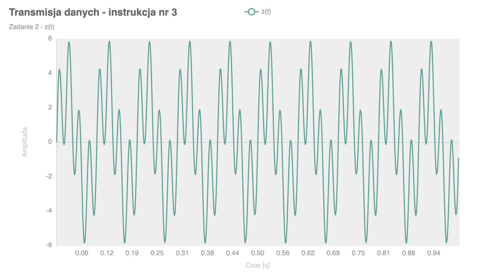

# University Signal Transformation

## Polski

Repozytorium zawiera programy napisane w języku **Go**, przygotowane w ramach zadania uczelnianego z przedmiotu **Transmisja Danych**.

Projekt dotyczy generowania sygnałów, ich przetwarzania oraz prezentacji wyników w formie wykresów. Kod został uporządkowany w kilku katalogach odpowiadających kolejnym etapom pracy nad zadaniami.

### O projekcie
- projekt uczelniany
- przedmiot: **Transmisja Danych**
- język: **Go**
- wizualizacja wyników w formie wykresów

### Przykładowy wykres
Tutaj można dodać przykładowy wykres wygenerowany przez program:

---

## English

This repository contains programs written in **Go**, created as part of a university assignment for the **Data Transmission** course.

The project focuses on signal generation, signal processing, and presenting results in the form of charts. The code is organized into several directories corresponding to different stages of the coursework.

### About the project
- university assignment
- course: **Data Transmission**
- language: **Go**
- result visualization in the form of charts

### Example chart
You can place an example chart generated by the program here:

