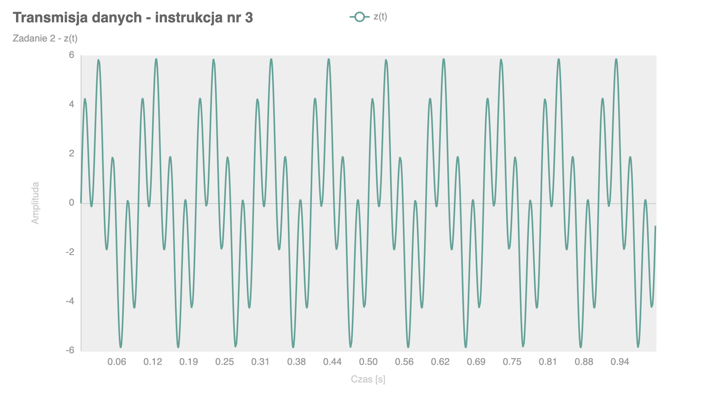
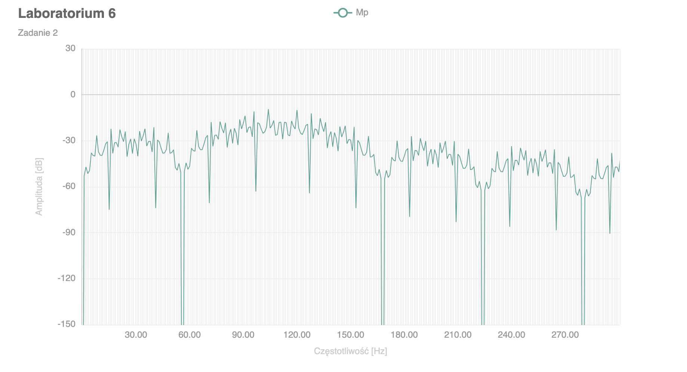
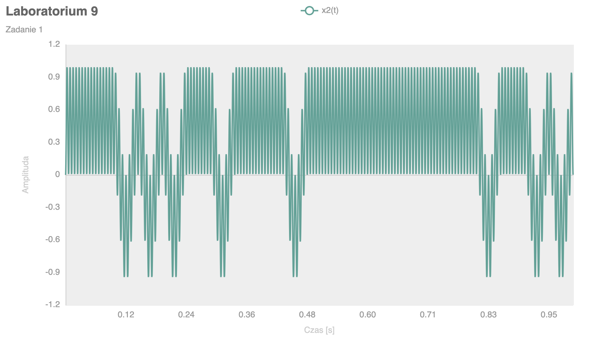
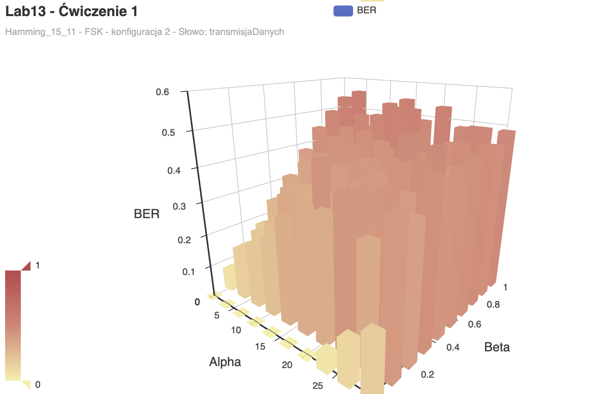

# University Signal Transformation

## Polski

Repozytorium zawiera programy napisane w języku **Go**, przygotowane w ramach zadania uczelnianego z przedmiotu **Transmisja Danych**.

Projekt dotyczy generowania sygnałów, ich przetwarzania oraz prezentacji wyników w formie wykresów. Kod został uporządkowany w kilku katalogach odpowiadających kolejnym etapom pracy nad zadaniami.

### O projekcie
- projekt uczelniany
- przedmiot: **Transmisja Danych**
- język: **Go**
- wizualizacja wyników w formie wykresów

### Wykorzystane narzędzia i biblioteki
- **Go** — główny język programowania użyty do implementacji projektu
- **go-echarts** — generowanie i prezentacja wykresów, w tym wykresów 2D oraz 3D
- **Gonum** — obliczenia numeryczne oraz operacje matematyczne związane z przetwarzaniem sygnałów
- **FFT** — analiza sygnałów w dziedzinie częstotliwości z wykorzystaniem szybkiej transformaty Fouriera
- **math** — podstawowe operacje matematyczne, m.in. funkcje trygonometryczne i obliczenia pomocnicze
- **testify** — wsparcie przy testowaniu kodu
- **go-spew**, **go-difflib**, **yaml.v3** — zależności pomocnicze wykorzystywane przez biblioteki testowe

### Przykładowe wykresy

### Przykładowy wykres 3D

---

## English

This repository contains programs written in **Go**, created as part of a university assignment for the **Data Transmission** course.

The project focuses on signal generation, signal processing, and presenting results in the form of charts. The code is organized into several directories corresponding to different stages of the coursework.

### About the project
- university assignment
- course: **Data Transmission**
- language: **Go**
- result visualization in the form of charts

### Tools and libraries used
- **Go** — main programming language used to implement the project
- **go-echarts** — chart generation and visualization, including 2D and 3D charts
- **Gonum** — numerical computations and mathematical operations related to signal processing
- **FFT** — frequency-domain signal analysis using the Fast Fourier Transform
- **math** — basic mathematical operations, including trigonometric functions and helper calculations
- **testify** — support for writing and running tests
- **go-spew**, **go-difflib**, **yaml.v3** — helper dependencies used by testing libraries

### Example charts

### Example 3D chart

